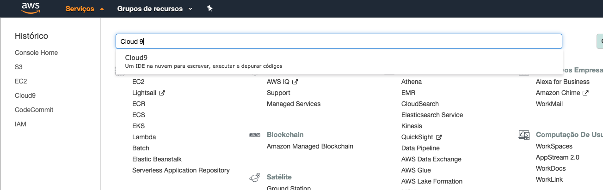

# 01 - Setup e Configuração de ambiente

 1. Abra o console da AWS e va para o serviço `Cloud 9`.
   
1. garanta que a região que esta utilizando é `us-east-1/ Norte da Virgínia`. Você consegue ver isso no canto superior direiro da tela.
    
 2. Clique em `create environment`.
 3. Coloque o nome `lab-fiap` e avance.
 
 5. Deixe as configurações como na imagem a seguir. Se atente ao tipo da maquina que deve ser t2.medium:

 6. Caso os parametros estejam como na imagem a seguir clique em `Create Environment`
   
 7. A criação do ambiente pode levar alguns minutos.

 8. Após a criação clique em `abrir IDE`, caso o IDE não tenha aberto automaticamente.
   
9. Para os próximos comandos utilize o console bash que fica no canto inferior do seu IDE.
   
10. Execute o comando `npm install -g serverless` para instalar o serverless framework.
    
11. Execute o comando `sudo apt  install jq -y` para instalar o software que irá nos ajudar a ler e manipular Jsons no terminal
12. Execute o comando `npm install -g c9` para baixar a extenãp que ajudará o Cloud9 a lidar melhor com o como abrir arquivos no IDE.
13. Execute o comando `pip3 install boto3 && pip3 install awscli` para instalar o SDK e cliente da AWS para linha de comando.
14. Execute o comando `git clone https://github.com/vamperst/fiap-database-as-a-service.git` para clonar o repositório com os exercicios.
15. Execute o comando `cd fiap-database-as-a-service/` para entrar na pasta criada pelo git
16. Execute o comando `cd 00-Setup-e-configuracao` para entrar na pasta com os scripts de Configuração.
17. Precisamos aumentar o tamanho do volume(HD) do cloud9. Para isso execute o comando  `sh resize.sh`
   
18. Agora vamos criar o Bucket S3 que irá receber todos os arquivos de configuração durante o curso. Para tal, abra uma aba do console AWS. Clique em serviços no canto superior esquerdo e pesquisa e clique em S3.
19. Clique em 'Criar bucket'
    
20. De o nome do bucket de `base-config-<SEU RM>` e clique em `Criar`.
    
21. Em outra aba do AWS Academy onde acessa a conta da AWS e no canto superior direito clique em 'AWS Details' e clique em 'show' nos campos de SSH Key.

23. Copie o conteudo da chave privada para a area de transferência(Ctrl+C).
    
24. Execute o comando `c9 open ~/.ssh/vockey.pem` para criar o arquivo que utilizaremos como chave para entrar nas instancias. 
25. Cole o conteudo da chave privada copiado nos passos anteriores e cole no ide no aquivo vockey.pem e salve utilizando "ctrl+S".
26.  Execute o comando `chmod 400 ~/.ssh/vockey.pem` para que a chave tenha a permissão correta.
27. Execute o comando a seguir para instalar o terraform `sh installTerraform.sh`
