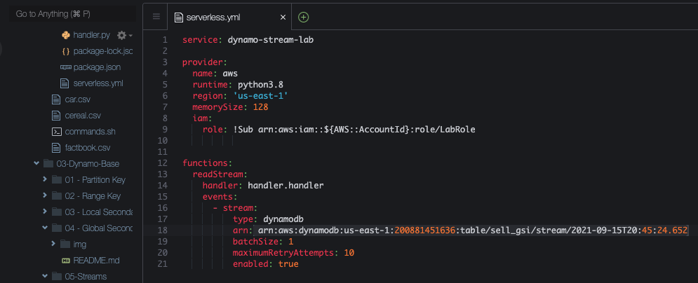
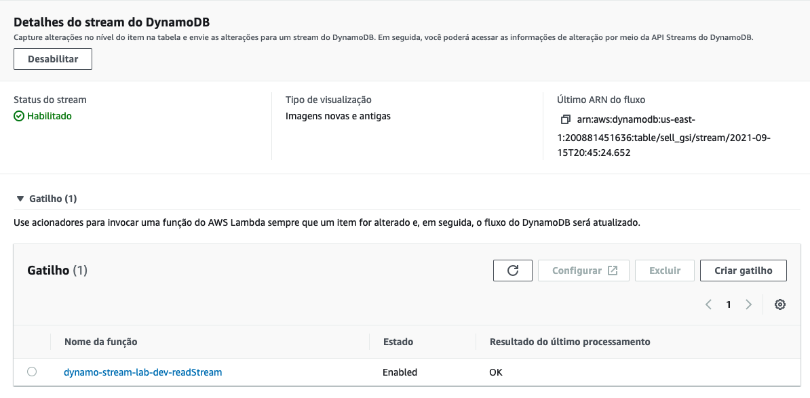
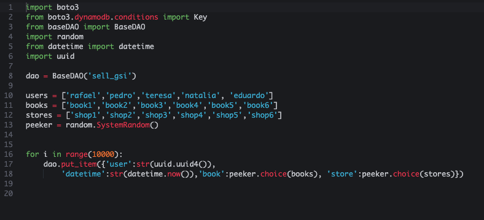
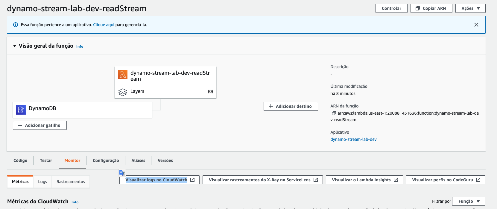
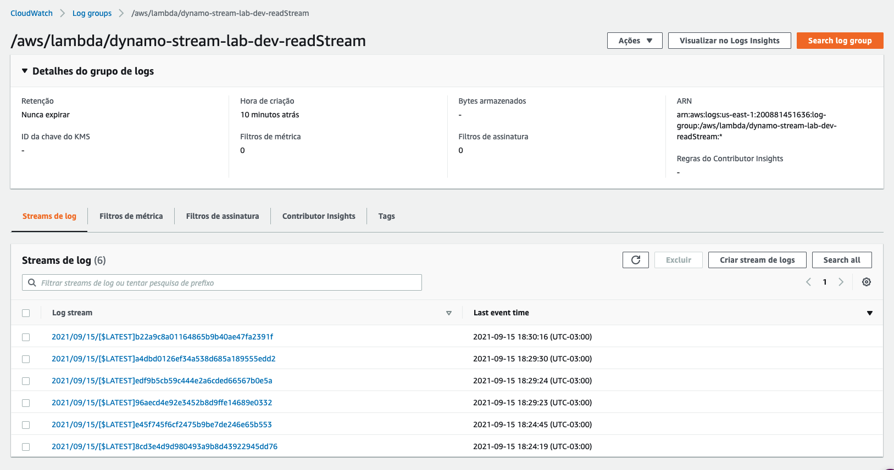
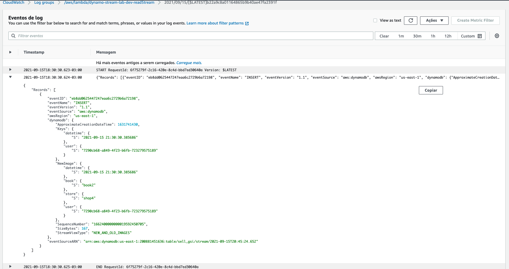

# 03.5 - Dynamo Streams

1. Vamos utilizar a tabela sell_gsi criada no exercicio anterior. 
2. Acesse o painel do dynamo e clique na table sell_gsi
3. Nessa tabela vá até a aba 'Exportações e streams', em 'Detalhes do stream do DynamoDB' clique em 'Habilitar'.
4. Escolha `Imagens novas e antigas` e finalize a operação. 
5. Você verá que o resultado ficará como na imagem.
   
6. Retorne ao Cloud9 e execute o comando `cd ~/environment/fiap-database-as-a-service/01-Dynamo-Base/05-Streams/Lambda/` para entrar na pasta onde irá fazer o deploy do lambda que irá ler o Stream recem criado.
7. Abra o arquivo serverless.yml com o comando `c9 open serverless.yml`
8. Copie o arn do dynamoDB que acabou de criar e cole na linha 18 como na imagem e salve o arquivo
   
8. Agora para fazer o deploy do lambda execute o comando `npm install -g serverless && sls deploy`
    
9. De volta ao painél da tabela sell_gsi, na aba 'Exportações e streams', poderá confirmar que existe um gatilho para um lambda.
    
10. Clique no nome 'dynamo-stream-lab-dev-readStream' do lambda para abrir ele em outra aba. Mantenha essa aba aberta
11. De volta ao Cloud9. Execute o comando `cd ~/environment/fiap-database-as-a-service/01-Dynamo-Base/05-Streams/`
12. Vamos inserir dados na tabela com o script ' insert-table.py'. Execute o comando `python3 insert-table.py`
    
13. Enquanto o script é executado, retorne a aba onde esta o lambda, clique na aba 'Monitor' e em sequencia no botão 'Visualizar logs no CloudWatch'
    
14. Clique em um dos stream de log disponiveis.
    
15. Verifique que o lambda esta imprimindo cada registro inserido no dynamoDB
    